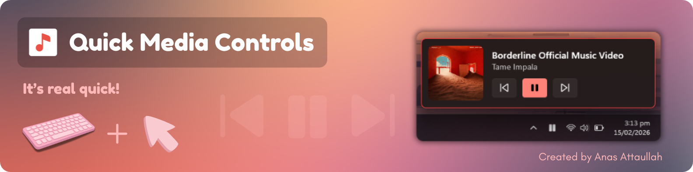

  <!-- Badges -->
  
  
  
  
  
  

A Windows tray app that lets you control whatever is currently playing on your PC without opening the player.

**It's super quick ⚡:**

* **Single Left Click** → Play / Pause ▶️
* **Double Left Click** → Next track ⏭️
* **Right Click** → Open the Flyout 📤
---

## Download (Installer) ⬇️

Prefer building it yourself? Jump to **[Build from source](#Requirements)**.

---

## Install & run 🖥️

1. Download the setup file from Releases (example: `QuickMediaControls-Setup-...exe`)
2. Run the installer
3. Launch **Quick Media Controls**
4. Find it in the **system tray** (near the clock)  
   - If you don’t see it, click the **^** arrow to show hidden tray icons

**💡Tip:** On first use, **pin the tray icon** so it’s always visible.

---

## Features ✨

- **Feels native on Windows 10 & 11**
- **Light + Dark mode** support
- Uses your **Windows accent color** for a clean, consistent look
- Works with **whatever Windows is currently playing** (music apps, browsers, players, etc.)
- **Flyout panel**
  - Title / artist / album art (when available)
  - Previous / Play-Pause / Next buttons
  - Smooth **open & close animations**
- **Smart tray icon**
  - Changes based on play/pause
  - Shows **No Media Playing** when nothing is active
- **Automatic updates**
  - Helps you stay up to date

---

## Screenshots 🖼️

|                     | Dark Mode | Light Mode |
|---------------------|-----------|------------|
| **Media Playing**   |  |  |
| **No Media Playing**|  |  |

---

## Build from source 🛠️

### Requirements
- Windows 10/11
- Visual Studio 2022+ (Visual Studio 2026 works)
- .NET 8 SDK

### Steps
1. Open the solution in Visual Studio
2. Build and run
3. The app will appear in the **system tray**

---

## Help / FAQ ❓

**Where is the app window?**  
It’s designed to live in the **tray**. Use the tray icon to control playback and open the flyout.

**Can it start with Windows?**  
Yes, there’s an installer option to launch on startup.

---

## Contributing 🤝

Ideas, issues, and PRs are welcome:  
- Issues: [GitHub Issues](https://github.com/AnasAttaullah/Quick-Media-Controls/issues)

---

## License 📜

Licensed under the **GNU GPL v3.0** — see `LICENSE.txt`.
