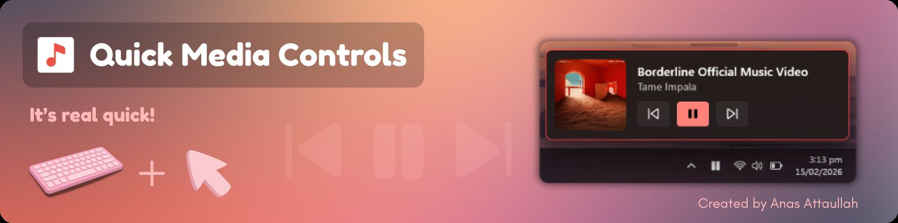
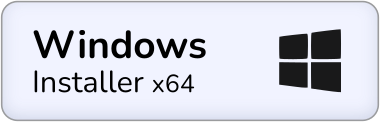
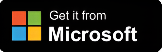
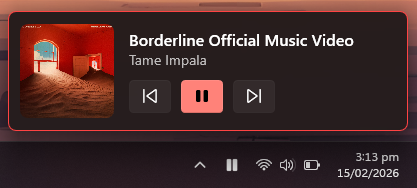
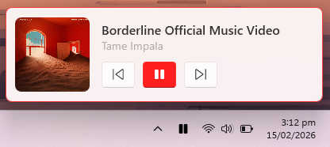
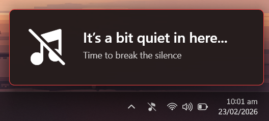
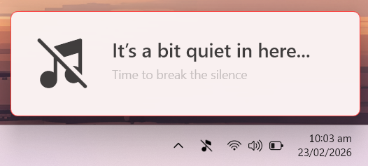
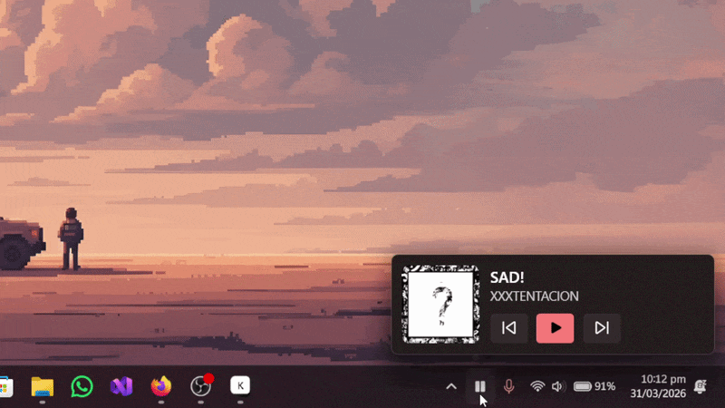
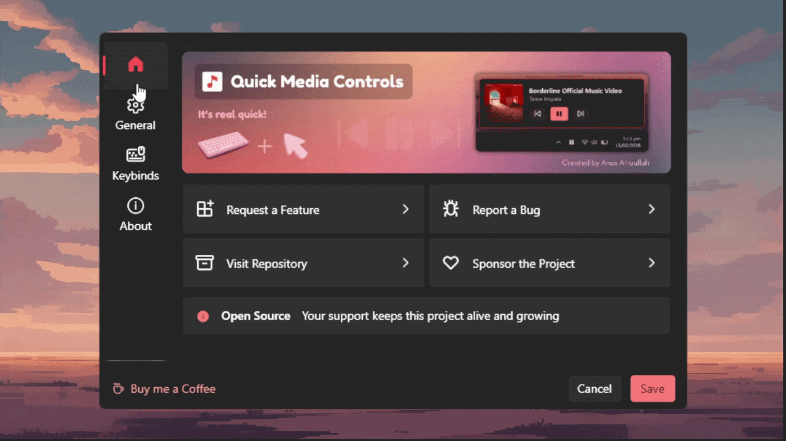

  <!-- Badges -->
  
  
  
  
  
  

#### A lightweight Windows tray app that lets you control any media playing on your PC without opening the player

It's super quick ⚡:

<table>
  <tr>
    <th>Action</th>
    <th>Mouse Input</th>
    <th>Keyboard Shortcut</th>
  </tr>
  <tr>
    <td>Play or Pause</td>
    <td>Left Click</td>
    <td><code>Alt + P</code></td>
  </tr>
  <tr>
    <td>Next Track</td>
    <td>Double Click</td>
    <td><code>Alt + N</code></td>
  </tr>
  <tr>
    <td>Previous Track</td>
    <td>—</td>
    <td><code>Alt + Shift + P</code></td>
  </tr>
  <tr>
    <td>Open Flyout</td>
    <td>Right Click</td>
    <td><code>Alt + O</code></td>
  </tr>
</table>

> All keybindings are fully customizable from the settings window.
---

## Download ⬇️

> The installer bundles .NET 8, which increases the download size from **~14 MB** to **~65 MB**.

Prefer building it yourself? Jump to **[Build from source](#Requirements)**.

---

## Installation 🖥️

1. Download the setup file from Releases (example: `QuickMediaControls-Setup-...exe`)
2. Run the installer
3. Launch **Quick Media Controls**
4. Find it in the **system tray** (near the clock)  
   - If you don’t see it, click the **^** arrow to show hidden tray icons

**Tip:** On first use, **pin the tray icon** so it’s always visible.

---

## Features ✨

- **Native experience** on Windows 10 & 11  
- **Light & Dark mode** with Windows accent color  
- **Universal media support** – works with apps, browsers, and players  
- **Flyout panel**: shows title, artist, album art, and playback controls  
- **Smart tray icon**: displays play/pause state or “No Media Playing”  
- **Keyboard & mouse shortcuts** with custom keybinds  
- **Multi-display & DPI aware**  
- **Customizable settings window**  
- **Automatic updates** to keep you up to date

---

## Showcase 🖼️

#### Trailer

https://github.com/user-attachments/assets/61f0dea8-6c25-40d1-8a48-cc870b52eefd

#### Screenshots

<table>
  <tr>
    <th></th>
    <th>Dark Mode</th>
    <th>Light Mode</th>
  </tr>
  <tr>
    <td><b>Media Playing</b></td>
    <td></td>
    <td></td>
  </tr>
  <tr>
    <td><b>No Media Playing</b></td>
    <td></td>
    <td></td>
  </tr>
</table>

#### Mouse Click Actions

  

#### Settings Windows

  

---

## Build from source 🛠️

### Requirements
- Windows 10/11
- Visual Studio 2022+
- .NET 8 SDK

### Steps
1. Clone the repository:
   `git clone https://github.com/AnasAttaullah/Quick-Media-Controls.git`
2. Open `Quick-Media-Controls.sln` in Visual Studio
3. Restore NuGet packages (if prompted)
4. Build and run (`F5`)
5. The app will appear in the **system tray** (near the clock)

---

## Help / FAQ ❓

  
<strong>Where is the app tray?</strong>

   
  The app runs in the <strong>system tray</strong> (near the clock).  
  If you don’t see it, click the <strong>^</strong> arrow to show hidden tray icons.

  
<strong>How do I open the settings window?</strong>

   
  Right-click the media flyout, then select <strong>Settings</strong>.

  
<strong>GitHub vs Microsoft Store version?</strong>

   
  <strong>GitHub version</strong>: completely free forever, supports <strong>x64</strong> only. 
  <strong>Microsoft Store version</strong>: also free, Microsoft-scanned/signed, supports <strong>x86 (32-bit), x64, and ARM64</strong>.

---

## Contributing 🤝

Ideas, suggestions, and contributions are always welcome.

- Report bugs or request features: [GitHub Issues](https://github.com/AnasAttaullah/Quick-Media-Controls/issues)
- Submit improvements via pull requests

---

## License 📜
Licensed under the **GNU GPL v3.0**. See `LICENSE.txt` for details.
