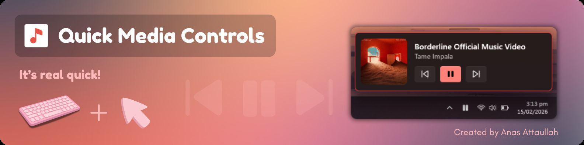
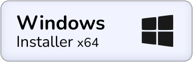
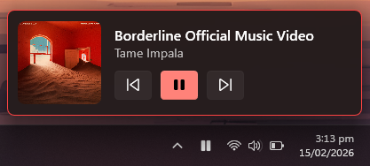
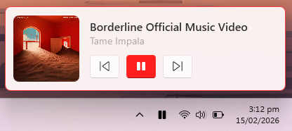
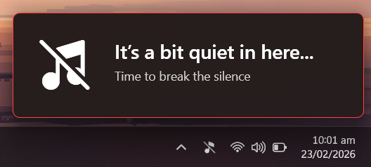
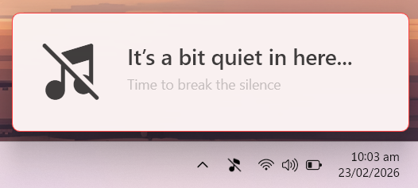
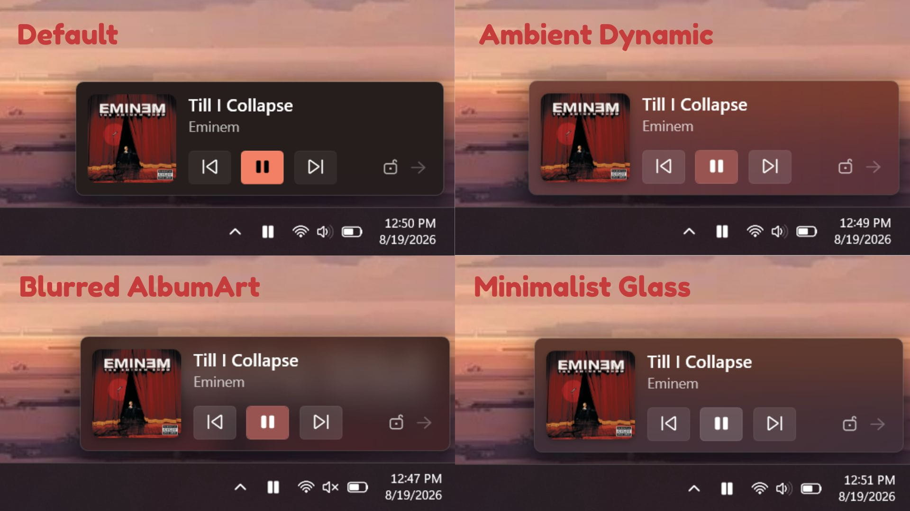
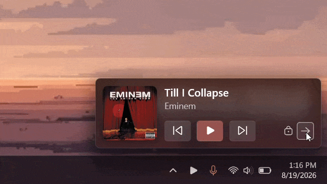
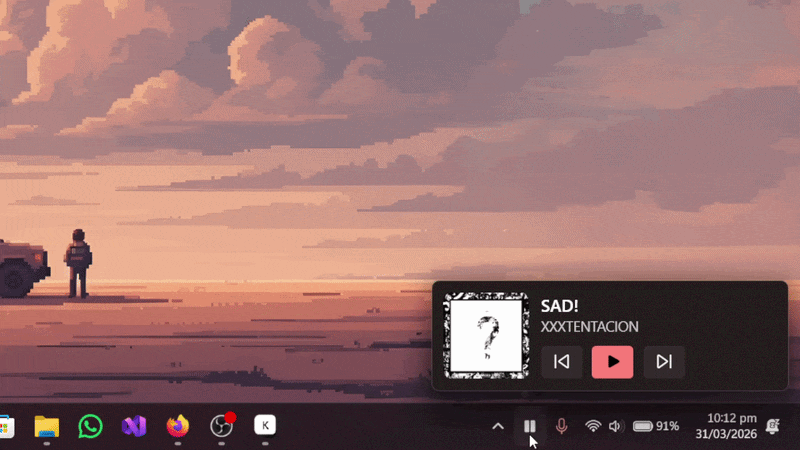
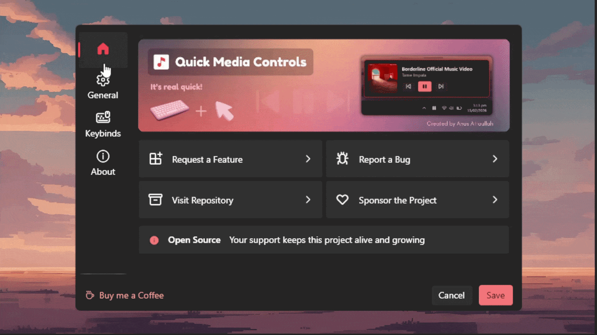

<p align="center">
  <!-- Badges -->
  <a href="https://github.com/AnasAttaullah/Quick-Media-Controls/releases/latest">
     
  </a>
  <a href="https://github.com/AnasAttaullah/Quick-Media-Controls/blob/main/LICENSE.txt">
    
  </a>
  
  
  
  <a href="https://github.com/AnasAttaullah/Quick-Media-Controls/issues">
    
  </a>
  <a href="https://github.com/AnasAttaullah/Quick-Media-Controls/releases/latest">
    
  </a>
</p>


#### A lightweight Windows tray app that lets you control any media playing on your PC without opening the player

It's super quick ⚡:

<table>
  <tr>
    <th>Action</th>
    <th>Tray Icon</th>
    <th>Keyboard + Mouse Shortcut</th>
  </tr>
  <tr>
    <td>Play or Pause</td>
    <td>Left Click</td>
    <td><code>Alt + P</code> &nbsp;/&nbsp; <code>Alt + Right Click</code></td>
  </tr>
  <tr>
    <td>Next Track</td>
    <td>Double Click</td>
    <td><code>Alt + N</code> &nbsp;/&nbsp; <code>Alt + Mouse 5</code></td>
  </tr>
  <tr>
    <td>Previous Track</td>
    <td>—</td>
    <td><code>Alt + Shift + P</code> &nbsp;/&nbsp; <code>Alt + Mouse 4</code></td>
  </tr>
  <tr>
    <td>Open Flyout</td>
    <td>Right Click</td>
    <td><code>Alt + O</code></td>
  </tr>
</table>

> All keybindings are fully customizable from the settings window.
---

## Download ⬇️

<p align="left">
  <a href="https://get.microsoft.com/installer/download/9msq5ct443tv?referrer=appbadge">
    
  </a>
  <a href="https://github.com/AnasAttaullah/Quick-Media-Controls/releases/latest">
    
  </a>
</p>

<details>
  <summary><strong>Compare: Microsoft Store vs GitHub Release</strong></summary>
  <br/>
  <table>
    <tr>
      <th>Feature</th>
      <th>Microsoft Store ⭐️ (Recommended)</th>
      <th>GitHub Release</th>
    </tr>
    <tr>
      <td><b>Price</b></td>
      <td>Free for now</td>
      <td>Free forever</td>
    </tr>
    <tr>
      <td><b>Support the Project</b></td>
      <td>❤️ Supports ongoing development</td>
      <td>—</td>
    </tr>
    <tr>
      <td><b>Device Support</b></td>
      <td>x86 (32-bit), x64, ARM64</td>
      <td>x64 only</td>
    </tr>
    <tr>
      <td><b>Updates & Install</b></td>
      <td>One-click install & automatic updates</td>
      <td>Manual setup installer</td>
    </tr>
    <tr>
      <td><b>Security</b></td>
      <td>Microsoft verified & signed</td>
      <td>Open source releases</td>
    </tr>
  </table>
</details>

<p></p>

> Prefer building from source? See the **Build from source** section below.

---

## Installation 🖥️

#### Microsoft Store (Recommended)
1. Install directly from the [Microsoft Store](https://apps.microsoft.com/detail/9msq5ct443tv).
2. Launch the app. It will appear directly in your system tray.

#### GitHub Installer (.exe)
1. Download `QuickMediaControls-Setup-...exe` from [Releases](https://github.com/AnasAttaullah/Quick-Media-Controls/releases/latest).
2. Run the installer and launch **Quick Media Controls**.
3. Locate the icon in your **system tray** (near the clock). If hidden, click the **^** arrow.

> **Tip:** Pin the tray icon so your media controls are always one click away.

---

## Features ✨

- **Native Windows UI**: Designed for Windows 10 & 11 with dark mode, light mode, and accent colors.
- **Dynamic Themes**: Ambient album art colors, Blurred Artwork, and Minimalist Glass.
- **Multi-Source Support**: Cycle between active media sessions or lock to a specific player.
- **Dual Shortcuts**: Primary and secondary keybind slots with full keyboard and mouse support.
- **Mouse Hotkeys**: Bind media actions to mouse buttons (Middle click, Mouse 4, Mouse 5).
- **Custom Tray Clicks**: Assign single, double, right, and middle clicks on the tray icon.
- **Smooth Animations**: Directional slide animation adapts to your taskbar position.
- **Position Memory**: Remembers custom flyout placement across restarts.
- **Ultra-Lightweight**: Uses only ~10–12 MB memory on idle.
- **Universal Support**: Works with Spotify, Apple Music, YouTube, web browsers, and local players.
- **Multi-Display & DPI Aware**: Crisp scaling on high-DPI and multi-monitor setups.

---

## Showcase 🖼️

#### Trailer

https://github.com/user-attachments/assets/61f0dea8-6c25-40d1-8a48-cc870b52eefd

#### Screenshots

<p align="center">
<table>
  <tr>
    <th></th>
    <th>Dark Mode</th>
    <th>Light Mode</th>
  </tr>
  <tr>
    <td><b>Media Playing</b></td>
    <td></td>
    <td></td>
  </tr>
  <tr>
    <td><b>No Media Playing</b></td>
    <td></td>
    <td></td>
  </tr>
</table>
</p>

#### Dynamic Flyout Themes
<p align="center">
  
</p>

#### Multi-Source Media Switching
<p align="center">
  
</p>

#### Mouse Click Actions
<p align="center">
  
</p>

#### Settings Window

<p align="center">
  
</p>

---

## Build from source 🛠️

### Requirements
- Windows 10 / 11
- .NET 8 SDK
- Visual Studio 2022+ (with .NET desktop development workload)

### Steps

```bash
# 1. Clone the repository
git clone https://github.com/AnasAttaullah/Quick-Media-Controls.git

# 2. Navigate to the project directory
cd Quick-Media-Controls

# 3. Build the project
dotnet build "Quick Media Controls/Quick Media Controls.csproj" -c Release

# 4. Run the app
dotnet run --project "Quick Media Controls/Quick Media Controls.csproj"
```

*Alternatively, open `Quick-Media-Controls.sln` in Visual Studio and press `F5`.*

---

## Help / FAQ ❓

<details>
  <summary><strong>Where is the app running?</strong></summary>
  <br/>
  The app runs in the <strong>system tray</strong> (near the clock).  
  If you don’t see it, click the <strong>^</strong> arrow in your taskbar to reveal hidden tray icons.
</details>

<details>
  <summary><strong>How do I open Settings?</strong></summary>
  <br/>
  Right-click the media flyout and select <strong>Settings</strong>.
</details>

<details>
  <summary><strong>How do I switch between multiple playing apps?</strong></summary>
  <br/>
  Use the source cycle button (right arrow) on the flyout to navigate between active media sessions, or click the lock icon to lock controls to your preferred player.
</details>

<details>
  <summary><strong>GitHub vs Microsoft Store version?</strong></summary>
  <br/>
  <table>
    <tr>
      <th>Feature</th>
      <th>Microsoft Store ⭐️ (Recommended)</th>
      <th>GitHub Release</th>
    </tr>
    <tr>
      <td><b>Price</b></td>
      <td>Free for now</td>
      <td>Free forever</td>
    </tr>
    <tr>
      <td><b>Support the Project</b></td>
      <td>❤️ Supports ongoing development</td>
      <td>—</td>
    </tr>
    <tr>
      <td><b>Device Support</b></td>
      <td>x86 (32-bit), x64, ARM64</td>
      <td>x64 only</td>
    </tr>
    <tr>
      <td><b>Updates & Install</b></td>
      <td>One-click install & automatic updates</td>
      <td>Manual setup installer</td>
    </tr>
    <tr>
      <td><b>Security</b></td>
      <td>Microsoft verified & signed</td>
      <td>Open source releases</td>
    </tr>
  </table>
</details>

---

## Contributing 🤝

Contributions, issues, and feature requests are welcome:

- **Guidelines**: Please read [CONTRIBUTING.md](CONTRIBUTING.md) before submitting pull requests.
- **Report a bug or request a feature**: Open an [issue](https://github.com/AnasAttaullah/Quick-Media-Controls/issues).
- **Discussions & Feedback**: Join the conversation in [GitHub Discussions](https://github.com/AnasAttaullah/Quick-Media-Controls/discussions).

> ⭐️ **Enjoying Quick Media Controls?** If you find this project helpful, please consider giving it a star on GitHub!

## License 📜
Licensed under the **GNU GPL v3.0**. See `LICENSE.txt` for details.

